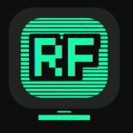
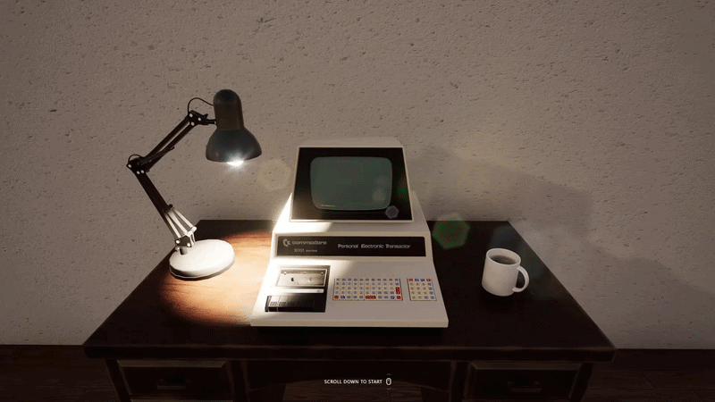

<div align="center">



<br/>

[](https://github.com/OguzGurv2/RetroFolio)

<br/>

[](https://nextjs.org/)
[](https://www.typescriptlang.org/)
[](https://threejs.org/)
[](https://tailwindcss.com/)
[](https://vercel.com/)

[](LICENSE)
[]()
[](https://github.com/OguzGurv2/RetroFolio/pulls)

</div>


A retro-cyberpunk developer portfolio built with **Next.js 15**, **Three.js**, and **Tailwind CSS v4**. Fork it, fill in two config files, and deploy — your portfolio goes live in minutes.

Desktop visitors get a fully interactive OS simulation — draggable windows, a taskbar, a boot/login sequence, and a WebGL CRT post-processing shader. Mobile visitors get a smooth SPA-style cyberpunk UI with animated transitions, a bottom nav, and a glitching clock widget.

> **Everything that makes this portfolio _yours_ lives in two files:** `src/app/_config/owner.ts` and `src/app/_config/portfolio.ts`. No component code needs to be touched.

---

## Table of Contents

- [Demo](#demo)
- [Features](#features)
- [Tech Stack](#tech-stack)
- [Getting Started](#getting-started)
- [Making It Your Own](#making-it-your-own)
  - [Step 1 — Fill in owner.ts](#step-1--fill-in-ownerts)
  - [Step 2 — Replace public assets](#step-2--replace-public-assets)
  - [Step 3 — Add your content in portfolio.ts](#step-3--add-your-content-in-portfoliots)
- [Versioning](#versioning)
- [Deploying to Vercel](#deploying-to-vercel)
- [Project Structure](#project-structure)
- [Architecture Notes](#architecture-notes)
- [Customising the Theme](#customising-the-theme)
- [Changelog](#changelog)
- [Roadmap](#roadmap)
- [License](#license)

---

## Demo

<table>
  <tr>
    <td align="center"><b>Desktop</b></td>
    <td align="center"><b>Mobile</b></td>
  </tr>
  <tr>
    <td></td>
    <td></td>
  </tr>
</table>

**Desktop** — scroll-driven 125-frame intro animation → retro boot log → credential-typing login sequence → fully interactive draggable OS rendered on a 2D canvas composited through a WebGL CRT shader (barrel distortion, scanlines, chromatic aberration, vignette, flicker).

**Mobile** — splash screen with progress bar → cyberpunk SPA. Bottom nav, animated cards, glitching clock widget, status top bar.

---

## Features

| Feature | Description |
|---|---|
| **CRT shader** | WebGL post-processing: barrel distortion, scanlines, chromatic aberration, vignette, flicker, rounded-corner masking |
| **Desktop OS simulation** | Draggable, closeable windows drawn on an offscreen 2D canvas, composited through the CRT material each frame |
| **Intro sequence** | 125-frame WebP image sequence played back on a `<canvas>` with scroll-driven autoplay and hardware-accelerated fade |
| **Login animation** | Retro boot log + credential-typing animation before the desktop appears |
| **Adaptive routing** | Root page detects viewport at the edge (Vercel middleware) and rewrites to `/d` or `/m` — zero JS shipped for the unused branch |
| **Session persistence** | Boot animation skipped for 10 minutes after the user has already seen it |
| **Window state persistence** | Desktop window positions and open/close state saved to `localStorage` and restored on the next visit |
| **Mobile SPA** | Fully client-side section navigation — no sub-routes, no page reloads |
| **Multi-language support** | Built-in locale system (React Context + `localStorage`) — add Turkish, English, or any language by filling in a second content block in `portfolio.ts`. A subtle fixed toggle appears only when 2+ languages are configured. The entire UI responds: windows, nav, boot sequence, login animation, and intro hint all switch instantly |
| **Versioning** | Pin a version string manually in `owner.ts`, or configure auto-versioning from commit count via the GitHub Compare API |
| **SEO** | JSON-LD Person schema, OpenGraph tags, Twitter card, hidden crawlable footer (because the desktop renders on `<canvas>`) |
| **Web manifest** | Dynamic `manifest.ts` — app name and short name come from `owner.ts` automatically |
| **Analytics** | Optional Google Analytics 4, Vercel Analytics, and Vercel Speed Insights — all configurable or removable |

> **Contributing a new feature?** Add a row to this table and a version entry to the [Changelog](#changelog) before opening your PR.

---

## Tech Stack

| Layer | Technology |
|---|---|
| Framework | [Next.js 15](https://nextjs.org/) (App Router, TypeScript) |
| 3D / Shaders | [Three.js 0.184](https://threejs.org/) — custom GLSL CRT ShaderMaterial |
| Styling | [Tailwind CSS v4](https://tailwindcss.com/) |
| Icons | [Bootstrap Icons](https://icons.getbootstrap.com/) (self-hosted woff2) |
| Font | [VT323](https://fonts.google.com/specimen/VT323) via `next/font/google` |
| Deployment | [Vercel](https://vercel.com/) |
| Analytics | Vercel Analytics · Vercel Speed Insights · Google Analytics 4 (optional) |

---

## Getting Started

### Prerequisites

- Node.js ≥ 20
- pnpm ≥ 9 — install with `npm i -g pnpm`

### Install and run locally

```bash
git clone https://github.com/your-username/your-repo.git
cd your-repo
pnpm install
pnpm dev
```

Open [http://localhost:3000](http://localhost:3000).

The root URL `/` automatically redirects to `/d` (desktop) or `/m` (mobile) based on your browser's user-agent. To force a specific layout during development, navigate directly to one of those paths.

### Build

```bash
pnpm build
pnpm start
```

---

## Making It Your Own

There are three steps. You do not need to touch any component file.

### Step 1 — Fill in owner.ts

Open **`src/app/_config/owner.ts`** and fill in every field. Every comment explains what each field does and where it appears in the UI.

| Field | What it affects |
|---|---|
| `name` / `displayName` | JSON-LD, SEO title, copyright line in the login animation |
| `jobTitle` | SEO title, JSON-LD |
| `bio` | Hidden SEO footer |
| `siteUrl` | `robots.txt`, `sitemap.xml`, OpenGraph URL, social image URL |
| `lang` | HTML `lang` attribute — set to your language code e.g. `"tr"`, `"de"` |
| `seoTitle` | Browser tab, search result heading, OpenGraph title |
| `seoDescription` | Search result snippet, OpenGraph description, Twitter card |
| `github` / `linkedin` / `email` | JSON-LD `sameAs`, hidden SEO footer |
| `socialImage` | OpenGraph image, Twitter card image — place file at `/public/social-preview.png` |
| `osName` | Auto-derived from your initials (e.g. `"JD-OS"`) — override if you prefer |
| `loginUsername` | Cosmetic username typed during the desktop login animation |
| `gaId` | Google Analytics 4 measurement ID — leave `""` to disable |
| `version` | Displayed in the OS status bar and boot sequence — see [Versioning](#versioning) |

### Step 2 — Replace public assets

These files cannot be driven from `owner.ts` — replace them manually before going live.

**Favicons** — generate all sizes at [realfavicongenerator.net](https://realfavicongenerator.net) and drop the files into `/public/favicon/`:

```
/public/favicon/favicon-16x16.png
/public/favicon/favicon-32x32.png
/public/favicon/apple-touch-icon.png
/public/favicon/android-chrome-192x192.png
/public/favicon/android-chrome-512x512.png
```

**Social preview image** — design a 1200 × 630 px image and save it as:

```
/public/social-preview.png
```

**Desktop intro animation** — the 125 frames in `/public/render/` are the original creator's 3D render. Replace them with your own:

1. Create or render a 125-frame animation (any tool — Blender, After Effects, etc.)
2. Export all frames as WebP images
3. Name them `Sequence5_000.webp` through `Sequence5_124.webp`
4. Drop them into `/public/render/` replacing the existing files

> If you want a different frame count or naming scheme, update the constants at the top of `src/app/(desktop)/_components/IntroSequence.tsx`.

### Step 3 — Add your content in portfolio.ts

Open **`src/app/_config/portfolio.ts`**. This is your content CMS.

#### The `about` section (mandatory)

Edit the pre-populated `about` window with your own information:

```ts
export const WINDOWS: WindowTemplate[] = [
  {
    id: "about",
    title: "ABOUT.exe",
    icon: "bi-person-fill",
    sections: [
      {
        subtitle: "Who am I?",
        body: [
          "Your role and location.",
          "What you build and what drives you.",
        ],
      },
    ],
  },
];
```

#### Adding more sections

`src/app/_config/sections-library.ts` contains five ready-made templates: **PROJECTS**, **SKILLS**, **CONTACT**, **EXPERIENCE**, and **EDUCATION**.

```ts
import { PROJECTS, SKILLS, CONTACT } from "./sections-library";

export const WINDOWS: WindowTemplate[] = [
  { id: "about", ... },
  PROJECTS.window,
  SKILLS.window,
  CONTACT.window,
];

export const MOBILE_NAV_ITEMS = [
  { id: "home",  icon: "bi-house-fill",  label: "Home"  },
  { id: "about", icon: "bi-person-fill", label: "About" },
  PROJECTS.nav,
  SKILLS.nav,
  CONTACT.nav,
];
```

Override any field by spreading:

```ts
{ ...PROJECTS.window, seeMoreLink: "https://github.com/your-username?tab=repositories" }
```

#### Adding a second language

Open `portfolio.ts` and fill in `WINDOWS_TR` (or your target language) with translated content. Then change:

```ts
export const AVAILABLE_LOCALES: Locale[] = ["en"]; // before
export const AVAILABLE_LOCALES: Locale[] = ["en", "tr"]; // after — toggle appears automatically
```

The language toggle renders only when this array has two or more entries.

#### Section links

```ts
{
  subtitle: "My Project",
  subtitleLink: "https://github.com/you/project",
  body: ["Description.", "Built with TypeScript."],
  bodyLinks: [
    { lineIndex: 1, url: "https://typescriptlang.org" },
  ],
}
```

#### Icons

- **Bootstrap Icons class** — `"bi-person-fill"` — browse at [icons.getbootstrap.com](https://icons.getbootstrap.com)
- **Custom image path** — `"/icons/star.svg"` — place the file in `/public/`

---

## Versioning

The version string appears in the OS status bar and the boot/login sequence.

### Option A — Manual (recommended)

```ts
version: "1.0.0",
```

Bump it whenever you deploy a meaningful update. The build ID (short Git SHA) is set automatically by Vercel.

### Option B — Auto from commit count (deploy-only)

> ⚠ Does **not** work in local development. Shows `v0.0.0 / unknown` locally.

Set `version: ""` in `owner.ts`, then add to Vercel **Environment Variables**:

| Variable | Description |
|---|---|
| `PORTFOLIO_REPO_OWNER` | Your GitHub username |
| `PORTFOLIO_REPO_NAME` | Your repository name |
| `PORTFOLIO_BASE_SHA` | Commit SHA to treat as `v0.0.0` — run `git log --oneline \| tail -1` |
| `GITHUB_KEY` / `GITHUB_TOKEN` / `GH_TOKEN` | GitHub PAT with repository read access — mark as **Sensitive** |

`VERCEL_GIT_COMMIT_SHA` is set automatically by Vercel.

Version scheme: 42 commits since base → `v0.4.2` · 123 commits → `v1.2.3`

---

## Deploying to Vercel

1. Push your repo to GitHub
2. Import at [vercel.com/new](https://vercel.com/new) — framework is detected automatically
3. If using auto-versioning, add the environment variables listed above
4. Deploy

The `vercel.json` at the repo root sets the framework to `nextjs` — no further configuration needed.

---

## Project Structure

```
src/
├── middleware.ts               # Edge UA detection → rewrites / to /d or /m
└── app/
    ├── layout.tsx              # Root layout — metadata, JSON-LD, analytics, credit bar
    ├── page.tsx                # Root page — triggers the middleware rewrite
    ├── globals.css             # Tailwind v4 base + cyber utility classes + keyframes
    ├── manifest.ts             # Dynamic web app manifest (uses owner.ts)
    ├── robots.ts               # robots.txt (uses owner.ts for siteUrl)
    ├── sitemap.ts              # sitemap.xml (uses owner.ts for siteUrl)
    │
    ├── _config/                # ← THE ONLY FOLDER YOU EDIT
    │   ├── owner.ts            # Identity, SEO, branding, versioning
    │   ├── portfolio.ts        # Portfolio content (windows + nav items + locale blocks)
    │   └── sections-library.ts # Ready-made section templates
    │
    ├── _i18n/
    │   └── LocaleContext.tsx   # React Context + localStorage locale persistence
    │
    ├── _constants/
    │   └── version.ts          # Reads NEXT_PUBLIC_OS_* build-time env vars
    │
    ├── _components/
    │   ├── CreditBar.tsx       # Fixed bottom credit bar
    │   ├── LangToggle.tsx      # Fixed top-right language toggle (hidden if < 2 locales)
    │   └── WindowIcon.tsx      # Renders Bootstrap icon class OR /public image path
    │
    ├── (desktop)/
    │   ├── DesktopClient.tsx   # Phase machine: scroll → loading → login → desktop
    │   ├── _components/
    │   │   ├── IntroSequence.tsx    # 125-frame scroll-driven canvas animation
    │   │   ├── LoadingAnimation.tsx
    │   │   ├── LoginAnimation.tsx   # Boot log + credential-typing animation
    │   │   └── crt/
    │   │       ├── index.tsx        # CRTScreen shell (sizing + overscan clip)
    │   │       ├── crtCanvas.ts     # useCRTCanvas — owns the Three.js render loop
    │   │       ├── material.ts      # CRT ShaderMaterial (GLSL vert + frag)
    │   │       └── renderer.ts      # WebGLRenderer factory
    │   ├── _constants/
    │   │   └── crt.ts           # Color tokens, glitch helpers, layout metrics
    │   └── home/
    │       ├── canvas.ts        # All 2D drawing: windows, taskbar, hit-testing
    │       └── DesktopHome.tsx  # Wires canvas.ts to useCRTCanvas
    │
    ├── (mobile)/
    │   ├── MobileClient.tsx    # Phase machine: loading → boot → home
    │   ├── _components/
    │   │   ├── BootAnimation.tsx    # Splash screen with progress bar
    │   │   ├── BottomBar.tsx        # Bottom navigation bar
    │   │   ├── Clock.tsx            # Glitching clock widget with SVG seconds ring
    │   │   ├── LoadingAnimation.tsx
    │   │   ├── TopBar.tsx           # Status bar (OS name + version)
    │   │   └── WindowPage.tsx       # Renders a portfolio entry as mobile cards
    │   ├── _constants/
    │   │   └── ui.ts            # Timing, glow tokens, glitch stagger helpers
    │   └── home/
    │       └── MobileHome.tsx   # SPA view router + TeaserCard grid
    │
    ├── d/
    │   └── page.tsx            # Desktop entry point (lazy-loaded)
    └── m/
        └── page.tsx            # Mobile entry point (lazy-loaded)
```

---

## Architecture Notes

### Desktop rendering pipeline

```
React state (phase)
  └─ DesktopHome
       └─ useCRTCanvas (hook in crtCanvas.ts)
            ├─ Offscreen 2D canvas  ←  canvas.ts draws all windows here every frame
            ├─ THREE.CanvasTexture   ←  uploaded to GPU each frame as a texture
            └─ CRT ShaderMaterial    →  rendered to the visible WebGL canvas
```

The 2D canvas and WebGL canvas are entirely separate elements. This lets all drawing code use the familiar Canvas 2D API while still getting the full CRT post-processing pass on every frame.

### Adaptive routing

`middleware.ts` runs at Vercel's edge network before any serverless function. It inspects the `User-Agent` header and rewrites `/` to `/d` (desktop) or `/m` (mobile). iPads are routed to desktop because iPadOS reports a desktop Safari user-agent.

### Session and state persistence

| Key in localStorage | Content | TTL |
|---|---|---|
| `{osName}-login-completed` | Timestamp (ms) | 10 minutes — boot animation skipped on revisit |
| `{osName}-desktop-state` | Window positions + focus order | Permanent — restored on next visit |
| `og-locale` | Selected locale (`"en"` / `"tr"`) | Permanent — language preference persisted |

The storage key prefix is derived from `OWNER.osName`, so forks with different OS names never share each other's state.

### SEO for canvas-rendered content

The desktop experience renders entirely on `<canvas>`, which search engines cannot read. `layout.tsx` includes a visually-hidden `<footer>` that exposes all portfolio content as crawlable HTML. It is pixel-clipped and `aria-hidden` so it is invisible to users but fully readable by Google.

---

## Customising the Theme

The CRT accent colour (`#00ff85`), background (`#0c0c0c`), and all derived RGBA variants live in:

```
src/app/(desktop)/_constants/crt.ts
```

Changing `ACCENT` and `BG` there propagates to the desktop canvas. For the mobile side and global CSS utilities, update the matching values in `src/app/globals.css`.

---

## Changelog

> When you add a new feature, add a row to the [Features](#features) table **and** an entry here before merging.

<details>
<summary><b>v1.2.0</b> — Multi-language support</summary>

**Released:** 2026-06-18

- Added `LocaleContext` — React Context + `localStorage` persistence for locale selection (`"og-locale"` key)
- Added `LangToggle` — fixed top-right language toggle; renders only when `AVAILABLE_LOCALES` has 2+ entries, invisible otherwise
- `portfolio.ts` now exports `WINDOWS_EN` / `WINDOWS_TR`, `getWindows(locale)`, `getMobileNavItems(locale)`, and `AVAILABLE_LOCALES`
- Desktop canvas rebuilds window content on locale change via `buildWindowContent()` + `useEffect([locale])`
- `IntroSequence` scroll hint text responds to locale ("SCROLL DOWN TO START" ↔ "BAŞLATMAK İÇİN AŞAĞI KAYDIRIN")
- `LoginAnimation` boot lines, header, field labels, and auth messages all respond to locale
- Mobile windows, nav labels, and window detail pages all respond to locale
- Default `AVAILABLE_LOCALES: Locale[] = ["en"]` — toggle stays hidden until you add a second locale

**How to add a language:**
1. Fill in `WINDOWS_TR` (or your locale block) in `portfolio.ts`
2. Add your locale to `AVAILABLE_LOCALES`
3. The toggle appears automatically — no component changes needed

</details>

<details>
<summary><b>v1.1.0</b> — Window state persistence</summary>

**Released:** earlier

- Desktop window positions and open/close state saved to `localStorage`
- State key namespaced to `OWNER.osName` to prevent cross-fork conflicts
- Restored automatically on the next visit within the same browser

</details>

<details>
<summary><b>v1.0.0</b> — Initial release</summary>

**Released:** earlier

- Desktop OS simulation with draggable windows on offscreen 2D canvas
- WebGL CRT post-processing shader (barrel distortion, scanlines, chromatic aberration, vignette, flicker)
- 125-frame scroll-driven intro animation
- Retro boot log + credential-typing login animation
- Mobile cyberpunk SPA with bottom nav, glitching clock, status bar
- Adaptive routing via Vercel edge middleware
- Two-file content configuration (`owner.ts` + `portfolio.ts`)
- Auto-versioning from GitHub commit count
- JSON-LD Person schema, OpenGraph, Twitter card, hidden SEO footer

</details>

---

## Roadmap

<div align="center">

[]()

</div>

### v1.x — Current

- [x] Desktop OS simulation with WebGL CRT shader
- [x] 125-frame scroll-driven intro sequence
- [x] Retro boot log + login animation
- [x] Mobile cyberpunk SPA
- [x] Two-file content configuration
- [x] Session + window state persistence
- [x] Auto-versioning from commit count
- [x] Multi-language support (EN / TR, extensible)

### v2.0.0 — The 90s Era _(Planned)_

> The big one. RetroFolio v2 introduces a second OS skin — a 90s-style desktop (think Windows 95 / Mac OS 8 aesthetics) — and lets visitors **upgrade their OS from within the website itself**.

| Feature | Description |
|---|---|
| **90s OS skin** | New desktop UI: title bars, window chrome, icons, taskbar, and boot sequence styled after mid-90s operating systems |
| **In-browser OS upgrade** | Visitors can trigger an "upgrade" animation that transitions from the 80s CRT experience to the new 90s UI — no page reload |
| **New boot sequence** | Era-appropriate startup screen and sound for the 90s OS |
| **90s icon set** | Pixel-art icons for windows and nav items |
| **Era toggle persistence** | Chosen OS era saved to `localStorage` — the user's OS survives page refreshes |
| **Config-driven** | Fork owners choose the default era in `owner.ts`; visitors can switch freely |

<details>
<summary>Show conceptual flow</summary>

```
User visits site
  └─ Loads their saved OS era (80s default if first visit)
       ├─ 80s era → current CRT experience (v1.x)
       └─ 90s era → new 90s OS skin
            └─ "Upgrade" button visible in desktop taskbar
                 └─ Triggers upgrade animation: CRT flicker → progress bar → 90s boot
```

</details>

---


<div align="center">

**Built with `</3` and too much caffeine.**

[](https://github.com/OguzGurv2/RetroFolio)

MIT License — see [LICENSE](LICENSE) for details.

</div>
